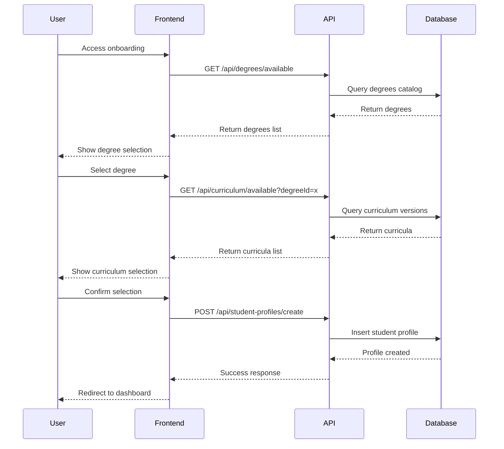

# UniLife Production Deployment Guide

## 🚀 Overview

This guide covers the complete deployment and operational procedures for the UniLife academic platform, including database schema, API contracts, monitoring, and emergency procedures.

## 📋 Table of Contents

1. [Database Schema](#database-schema)
2. [API Contracts](#api-contracts)
3. [Onboarding Flows](#onboarding-flows)
4. [Student Binding Rules](#student-binding-rules)
5. [Monitoring & Alerting](#monitoring--alerting)
6. [Runbooks](#runbooks)
7. [Emergency Procedures](#emergency-procedures)

---

## 🗄️ Database Schema

### Authoritative Data Layer

#### Universities
```sql
CREATE TABLE universities (
  id UUID PRIMARY KEY DEFAULT gen_random_uuid(),
  name TEXT NOT NULL,
  code TEXT UNIQUE NOT NULL,
  country TEXT NOT NULL,
  created_at TIMESTAMPTZ DEFAULT NOW(),
  updated_at TIMESTAMPTZ DEFAULT NOW()
);
```

#### Degrees Catalog
```sql
CREATE TABLE degrees_catalog (
  id UUID PRIMARY KEY DEFAULT gen_random_uuid(),
  university_id UUID REFERENCES universities(id) ON DELETE CASCADE,
  code TEXT NOT NULL,
  name TEXT NOT NULL,
  faculty TEXT NOT NULL,
  level TEXT NOT NULL,
  duration_years INTEGER NOT NULL,
  total_credits INTEGER NOT NULL,
  nqf_level INTEGER,
  created_at TIMESTAMPTZ DEFAULT NOW(),
  updated_at TIMESTAMPTZ DEFAULT NOW()
);
```

#### Modules Catalog
```sql
CREATE TABLE modules_catalog (
  id UUID PRIMARY KEY DEFAULT gen_random_uuid(),
  code TEXT UNIQUE NOT NULL,
  name TEXT NOT NULL,
  credits INTEGER NOT NULL,
  prerequisites TEXT,
  corequisites TEXT,
  minimum_credits INTEGER DEFAULT 0,
  created_at TIMESTAMPTZ DEFAULT NOW(),
  updated_at TIMESTAMPTZ DEFAULT NOW()
);
```

#### Curriculum Versions
```sql
CREATE TABLE curriculum_versions (
  id UUID PRIMARY KEY DEFAULT gen_random_uuid(),
  degree_id UUID REFERENCES degrees_catalog(id) ON DELETE CASCADE,
  academic_year INTEGER NOT NULL,
  version_hash TEXT NOT NULL,
  effective_date DATE NOT NULL,
  is_active BOOLEAN DEFAULT FALSE,
  created_at TIMESTAMPTZ DEFAULT NOW(),
  updated_at TIMESTAMPTZ DEFAULT NOW()
);
```

### Student Execution Layer

#### Student Profiles
```sql
CREATE TABLE student_profiles (
  id UUID PRIMARY KEY DEFAULT gen_random_uuid(),
  user_id UUID REFERENCES auth.users(id) ON DELETE CASCADE,
  university_id UUID REFERENCES universities(id) ON DELETE CASCADE,
  degree_id UUID REFERENCES degrees_catalog(id) ON DELETE CASCADE,
  curriculum_version_id UUID REFERENCES curriculum_versions(id) ON DELETE CASCADE,
  start_year INTEGER NOT NULL,
  binding_date TIMESTAMPTZ DEFAULT NOW(),
  status TEXT DEFAULT 'active',
  created_at TIMESTAMPTZ DEFAULT NOW(),
  updated_at TIMESTAMPTZ DEFAULT NOW(),
  UNIQUE(user_id, degree_id, start_year)
);
```

#### Student Module Instances
```sql
CREATE TABLE student_module_instances (
  id UUID PRIMARY KEY DEFAULT gen_random_uuid(),
  student_profile_id UUID REFERENCES student_profiles(id) ON DELETE CASCADE,
  module_code TEXT REFERENCES modules_catalog(code) ON DELETE CASCADE,
  status TEXT DEFAULT 'pending',
  grade INTEGER,
  attempt_count INTEGER DEFAULT 1,
  credits_earned INTEGER DEFAULT 0,
  created_at TIMESTAMPTZ DEFAULT NOW(),
  updated_at TIMESTAMPTZ DEFAULT NOW(),
  UNIQUE(student_profile_id, module_code)
);
```

### Audit & Monitoring

#### Academic Events
```sql
CREATE TABLE academic_events (
  id UUID PRIMARY KEY DEFAULT gen_random_uuid(),
  student_profile_id UUID REFERENCES student_profiles(id) ON DELETE CASCADE,
  event_type TEXT NOT NULL,
  old_value TEXT,
  new_value TEXT,
  reason TEXT,
  created_by UUID REFERENCES auth.users(id),
  created_at TIMESTAMPTZ DEFAULT NOW()
);
```

---

## 🔌 API Contracts

### Academic Validation API

#### POST `/api/academic/validate`

**Request:**
```json
{
  "action": "validateModuleAddition" | "checkModuleEligibility" | "validateSemesterPlan",
  "studentProfileId": "uuid",
  "data": {
    "moduleCode": "string",
    "semesterModules": ["string"]
  }
}
```

**Response:**
```json
{
  "valid": boolean,
  "errors": ["string"],
  "warnings": ["string"],
  "eligible": boolean,
  "prerequisitesMet": ["string"],
  "prerequisitesMissing": ["string"]
}
```

### Academic Progress API

#### GET `/api/academic/progress`

**Query Parameters:**
- `studentProfileId` (required): UUID of student profile
- `type` (optional): `basic` | `metrics` | `credits` | `performance` | `trends` | `projection` | `curriculum`

**Response (basic):**
```json
{
  "totalCredits": 120,
  "earnedCredits": 45,
  "completedModules": 8,
  "totalModules": 12,
  "averageGrade": 68.5,
  "gpa": 3.2,
  "academicStanding": "good",
  "progressPercentage": 37.5
}
```

### Degrees API

#### GET `/api/degrees/available`

**Response:**
```json
{
  "degrees": [
    {
      "id": "uuid",
      "code": "BScIT",
      "name": "Bachelor of Science in Information Technology",
      "faculty": "Engineering, Built Environment and Information Technology",
      "level": "undergraduate",
      "durationYears": 3,
      "totalCredits": 360
    }
  ],
  "university": {
    "id": "uuid",
    "name": "University of Pretoria",
    "code": "UP"
  }
}
```

---

## 🎓 Onboarding Flows

### New Student Onboarding

#### Flow Diagram
```
1. User Authentication
   ↓
2. Check Profile Status
   ↓ (if needs onboarding)
3. Welcome Step
   ↓
4. Degree Selection
   ↓
5. Curriculum Version Selection
   ↓
6. Profile Confirmation
   ↓
7. Create Student Profile
   ↓
8. Redirect to Dashboard
```

#### API Sequence


---

## 📚 Student Binding Rules

### Core Rules

1. **Permanent Binding**: Students are permanently bound to a curriculum version for their entire degree.
2. **One Profile Per Degree**: Students can only have one active profile per degree.
3. **No Retroactive Changes**: Curriculum updates do not affect existing student bindings.
4. **Prerequisite Enforcement**: Students cannot enroll in modules without meeting prerequisites.
5. **Credit Load Limits**: Maximum 60 credits per semester, recommended 45-50.

### Validation Rules

#### Module Eligibility
```typescript
interface ModuleEligibility {
  eligible: boolean;
  prerequisitesMet: string[];
  prerequisitesMissing: string[];
  corequisitesRequired: string[];
  creditsSufficient: boolean;
}
```

#### Grade Conversion Logic
```sql
CASE 
  WHEN currentGrade >= 50 THEN 'passed'
  WHEN currentGrade IS NOT NULL THEN 'failed'
  ELSE 'pending'
END as status
```

#### Credits Earned Calculation
```sql
CASE 
  WHEN status = 'passed' THEN modules.credits
  ELSE 0
END as credits_earned
```

---

## 📊 Monitoring & Alerting

### Metrics Collection

#### System Metrics
- **API Response Time**: Average response time per endpoint
- **Error Rate**: Percentage of failed requests
- **Database Query Time**: Performance of complex queries
- **Memory Usage**: Heap memory consumption
- **CPU Usage**: Processor utilization

#### Alert Thresholds
```javascript
const thresholds = {
  apiResponseTime: 1000,      // 1 second
  errorRate: 0.05,           // 5%
  concurrentUsers: 1000,       // 1000 users
  databaseQueryTime: 500,      // 500ms
  memoryUsage: 0.8,           // 80%
  cpuUsage: 0.8                // 80%
};
```

### Alert Types

#### Critical Alerts
- Database connection failures
- Authentication/authorization errors
- API response time > 2 seconds
- Error rate > 10%

#### Warning Alerts
- API response time > 1 second
- Memory usage > 80%
- CPU usage > 80%
- Multiple errors from same user

---

## 📖 Runbooks

### 1. UP_Scraper Ingestion

#### Trigger
- Monthly schedule (1st of month, 2 AM UTC)
- Manual trigger via GitHub Actions

#### Procedure
1. **Pre-Ingestion Checks**
   ```bash
   # Verify scraper accessibility
   curl -f https://www.up.ac.za/academic
   
   # Check for active student bindings
   node production/check-active-students.js
   ```

2. **Dry-Run Ingestion**
   ```bash
   cd lib/ingestion/up
   node pipeline.js --dry-run
   ```

3. **Safety Validation**
   ```bash
   # Check for large curriculum changes
   node production/validate-curriculum-changes.js
   
   # Verify no ongoing migrations
   node production/check-migration-status.js
   ```

4. **Production Ingestion**
   ```bash
   # Create backup
   node production/create-backup.js
   
   # Run ingestion
   node lib/ingestion/up/pipeline.js --production
   ```

5. **Post-Ingestion Verification**
   ```bash
   # Verify data integrity
   node production/verify-ingestion.js
   
   # Test API endpoints
   node production/test-api-endpoints.js
   ```

#### Rollback Procedure
```bash
# Identify backup to restore
BACKUP_NAME="pre-ingestion-$(date +%Y%m%d-%H%M%S)"

# Execute rollback
node production/rollback-to-backup.js --backup=$BACKUP_NAME

# Verify rollback
node production/verify-rollback.js
```

### 2. Database Migration

#### Pre-Migration Checklist
- [ ] Create full database backup
- [ ] Verify no active ingestions
- [ ] Test migration script on staging
- [ ] Prepare rollback script
- [ ] Notify maintenance window

#### Migration Execution
```bash
# 1. Create backup
node production/create-full-backup.js

# 2. Run migration
node production/run-migration.js --file=20250121_phase2_realistic_migration.sql

# 3. Verify migration
node production/verify-migration.js

# 4. Update application
# Deploy new version with migration support
```

#### Post-Migration Verification
- [ ] Verify data integrity
- [ ] Test all API endpoints
- [ ] Check application performance
- [ ] Monitor error logs
- [ ] Validate user access

### 3. Performance Issues

#### High API Response Time
```bash
# 1. Identify slow endpoints
node production/analyze-slow-queries.js

# 2. Check database performance
node production/check-db-performance.js

# 3. Review recent deployments
git log --oneline -10

# 4. Scale if needed
# Add more API instances or optimize database
```

#### Database Performance Issues
```bash
# 1. Check slow queries
SELECT query, mean_time, calls 
FROM pg_stat_statements 
WHERE mean_time > 500 
ORDER BY mean_time DESC 
LIMIT 10;

# 2. Check table sizes
SELECT schemaname, tablename, 
       pg_size_pretty(table_name) as size 
FROM pg_tables 
WHERE schemaname = 'public' 
ORDER BY pg_size_pretty(table_name) DESC;

# 3. Rebuild indexes
REINDEX TABLE student_module_instances;
REINDEX TABLE academic_events;
```

---

## 🚨 Emergency Procedures

### 1. Database Corruption

#### Detection
- High error rate in database queries
- Data integrity check failures
- User reports of missing data

#### Immediate Response
```bash
# 1. Stop all writes
UPDATE student_profiles SET status = 'maintenance';

# 2. Create emergency backup
node production/emergency-backup.js

# 3. Switch to read-only mode
# Configure database to read-only

# 4. Notify users
# Enable maintenance mode
```

#### Recovery Procedure
```bash
# 1. Restore from last known good backup
node production/restore-from-backup.js --backup=last-good-backup

# 2. Verify data integrity
node production/emergency-verification.js

# 3. Gradually restore services
# Enable read-only first, then writes

# 4. Monitor closely
# Enhanced monitoring for 24 hours
```

### 2. Security Incident

#### Detection
- Unauthorized access attempts
- Data exfiltration patterns
- Multiple failed logins from same IP

#### Response Procedure
```bash
# 1. Immediate containment
# Block suspicious IPs
# Revoke compromised sessions
# Enable enhanced logging

# 2. Investigation
node production/security-investigation.js

# 3. Remediation
# Patch vulnerabilities
# Reset affected passwords
# Audit access logs

# 4. Post-incident review
# Document lessons learned
# Update security procedures
```

### 3. Service Outage

#### Detection
- Monitoring alerts
- User reports
- Health check failures

#### Response Procedure
```bash
# 1. Assess impact
node production/assess-outage-impact.js

# 2. Communication
# Update status page
# Notify stakeholders
# Estimate recovery time

# 3. Recovery
# Identify root cause
# Implement fix
# Verify resolution

# 4. Post-mortem
# Document incident
# Update procedures
# Prevent recurrence
```

---

## 📞 Contact Information

### Primary Contacts
- **DevOps Lead**: [Contact Info]
- **Database Admin**: [Contact Info]
- **Security Team**: [Contact Info]
- **Product Manager**: [Contact Info]

### Escalation Procedures
1. **Level 1**: On-call engineer (0-30 minutes)
2. **Level 2**: Team lead (30-60 minutes)
3. **Level 3**: Management (60+ minutes)

### Communication Channels
- **Slack**: #unilife-alerts
- **Email**: unilife-alerts@company.com
- **Status Page**: status.unilife.com
- **Phone**: Emergency contact numbers

---

## 📝 Version History

| Version | Date | Changes | Author |
|---------|------|----------|---------|
| 1.0.0 | 2025-01-22 | Initial production deployment guide | DevOps Team |

---

## 🔗 Related Documents

- [API Documentation](./api-documentation.md)
- [Database Design](./database-design.md)
- [Security Guidelines](./security-guidelines.md)
- [Performance Tuning](./performance-tuning.md)

---

**Last Updated**: 2025-01-22  
**Next Review**: 2025-02-22  
**Approved By**: Production Operations Team
